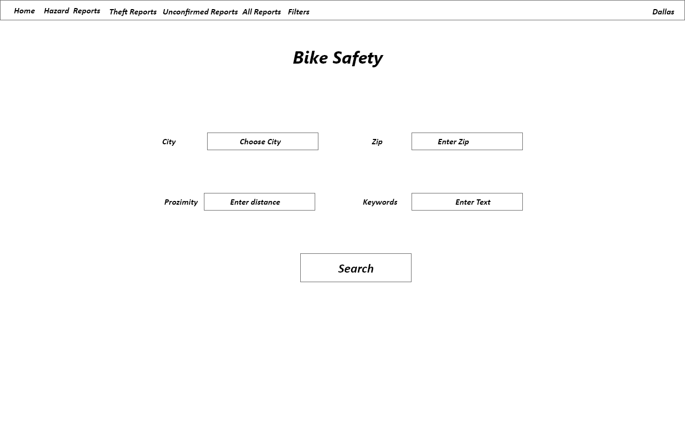

# bike-safety-app
# 
# API used: 
### 1) Bikewise incidents: https://www.bikewise.org/documentation/api_v2#!/incidents/GET_version_incidents_format_get_0
### 2) Reverse Geocodes lookup: https://www.bigdatacloud.com/geocoding-apis/free-reverse-geocode-to-city-api?gclid=CjwKCAjw1v_0BRAkEiwALFkj5oZPTWnaOELHK_9-whruEaiEOWboApfvBzBXuVnr_6dV43bsf_63SRoCDIoQAvD_BwE
# 
# Problem Statement
### Provide data on bike incidents in major cities to inform bikers and bike owners of safety issues in different parts of a city
# 
# Target users
### People who bike for fun, for work, and people who own bikes
# 
# Wireframe
### Home

### Filters for Search

### Hazard Sort - show zip codes with highest hazard reports

### Theft Sort - show zip codes with highest theft reports

### Crash Sort - show zip codes with highest crash reports

### Zip Codes - show Zip codes with highest overall reports

# 
# Components
### Stateful components
#### App.js - holds Ajax response data, etc
#### Filters.js - holds filer input
# 
### Functional components
#### HazardSort.js
#### TheftSort.js
#### CrashSort.js
#### ZipCodes.js
#
# Technologies used
### Redux to maintain city proximity of queried data (upper right of home screen)
### React bar chart package will be used (react-chartjs-2  chart.js)